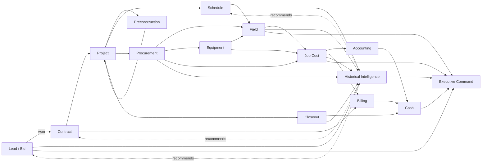
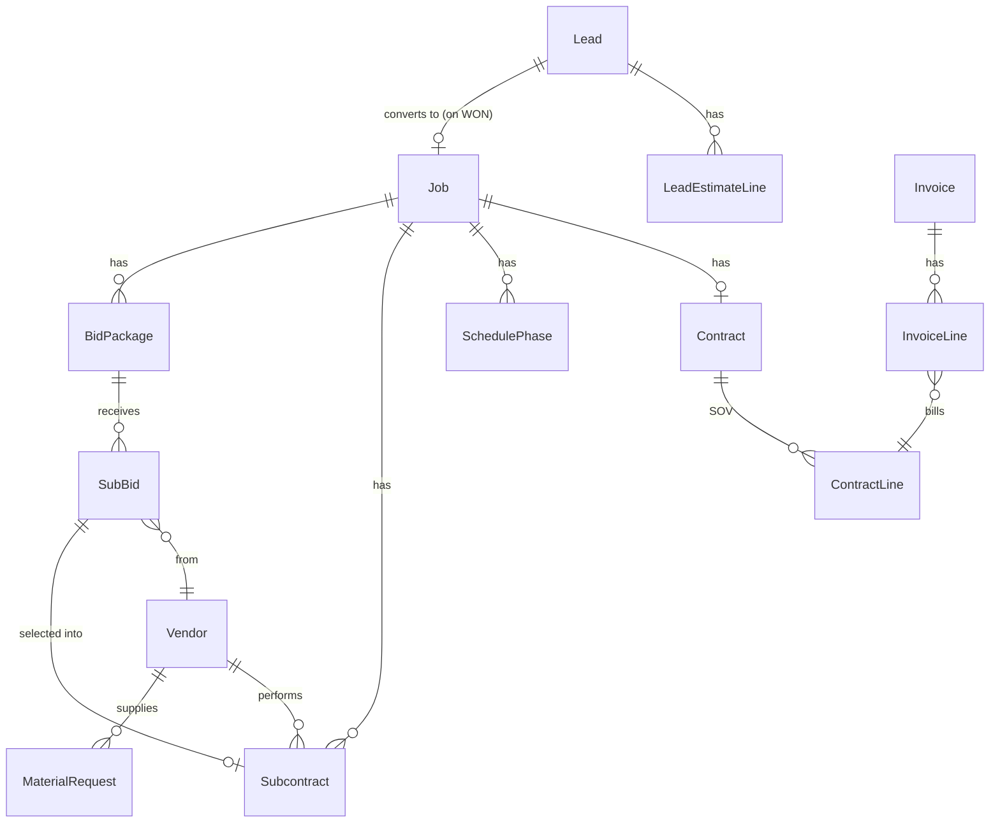

# CrewSync Company Operating System — Architecture

This document maps CrewSync's full lifecycle, end to end, and is the design
Claude (or anyone) builds the next phase from. It is a plan, not a changelog:
nothing in this document has been built yet except where a section is
explicitly marked **Exists**. Read it before starting the next phase; update
it as decisions get made, so it stays the one place the whole system's shape
lives.

## How to read this

- **Exists** — shipped, in the schema/code today. Cited by file/model name.
- **Partial** — a real building block exists but doesn't cover the full stage.
- **Missing** — nothing here yet; this document is the spec for it.
- Every stage lists what feeds it (**Inputs**) and what it automatically
  arms downstream (**Automation**) — the closed-loop, no-duplicate-entry
  principle that already runs this app is the organizing idea for
  everything proposed below, not a new one.

---

## 1. Design philosophy

Five principles, all already proven somewhere in this codebase. Every new
stage below is designed to keep them true, not introduce new ones.

1. **One fact, one place.** A foreman's daily report is the only place
   labor hours and quantity get entered — it drives job cost, productivity,
   and alerts automatically (`lib/daily-report-actions.ts`). Every new
   stage follows the same rule: field reality is authored once, everything
   downstream derives from it.
2. **Stage transitions are automation triggers, not just labels.**
   `ProjectStage` already drives checklist generation and, as of the
   estimate/actual loop, benchmark recording (`lib/command-center-actions.ts`).
   New stages (below) extend this same mechanism instead of inventing a
   parallel one.
3. **The tenant boundary is sacred, extend it, never work around it.**
   Every new model gets `scopedPrisma` treatment exactly like every
   existing tenant model (`lib/tenant.ts`) — either a direct `companyId` or
   verified inheritance from an already-scoped parent.
4. **Closed loops, not reports.** Historical Intelligence isn't a
   dashboard bolted on at the end — it's the destination every stage
   already feeds (cost codes → benchmarks, and by the design below: bids →
   win rate, schedules → duration accuracy, vendors → performance) and the
   source every stage upstream reads from live (already true for estimating;
   proposed the same way for bidding, scheduling, and procurement).
5. **Minimal, purpose-built, not generic.** Lead/Bid tracking below is bid
   tracking for a GC — win/loss, estimated value, source — not a sales CRM
   with pipelines and email sequences. Scheduling below is phase/milestone
   health, not a CPM/Gantt engine. Every new stage is sized to what this
   app's actual job (small-to-mid GC operations) needs, not what a generic
   construction-ERP feature list would include.

---

## 2. The full lifecycle



The dotted arrows are the point of this whole design: Historical
Intelligence isn't a terminal node, it's a feedback path back into the
stages that generate the next bid, contract, and schedule — the same
pattern the estimate/actual loop already proved works (a completed job's
`CostCodeBenchmark` rows show up live on the *next* job's Award form).

---

## 3. Stage by stage

### 3.1 Lead / Bid — **Built** (as `Opportunity`)

**Shipped as `Opportunity`/`OpportunityCostCode`** — the same design this
section proposed, renamed to match how the work was actually requested.
The target model/automation below is the original proposal and differs in
naming only (`Opportunity.stage` instead of `Lead.status`, no separate
`NEW`/`QUALIFYING`/`ESTIMATING` states — `OPPORTUNITY`/`BIDDING`/
`SUBMITTED` cover the same pre-decision ground); see
`docs/OPERATING-DATA-MODEL.md`'s §Opportunity for what's actually live.
Left below for the historical design rationale.

**Purpose.** Track what the company is chasing before it's a real job:
what's out to bid, its estimated value, and whether it was won — so win
rate becomes a measurable, filterable number instead of institutional
memory.

**Why not just an early `Job` stage.** Considered and rejected: leads
vastly outnumber wins (a healthy GC wins well under half of what it bids),
and every lost bid would leave a dead row consuming a `jobNumber`,
Command Center, and checklist — corrupting the "a Job is a real awarded
project" invariant every other stage, and every existing report, already
relies on. A `Lead` is a separate, lightweight entity; a `Job` (with a
`jobNumber`) is only ever created on **won**.

**Target model.**
```
Lead
  id, companyId
  title, customerId?  (existing Customer) | prospectName (free text, no customer yet)
  source          e.g. "Referral", "Plan room", "Repeat client"
  projectType     -- same free-text field Job.projectType already uses
  estimatedValue
  probability     0-100, PM's own read, not computed
  bidDueDate
  status          NEW | QUALIFYING | ESTIMATING | SUBMITTED | WON | LOST | NO_BID
  lostReason?     free text, only meaningful on LOST
  assignedToUserId (estimator/PM)
  wonJobId?       set once converted — the provenance link back from Job

LeadEstimateLine       -- deliberately parallel to JobCostCode, not a shared
  id, leadId, costCodeId  table: JobCostCode's shape and every query built
  estimatedQty, estimatedHours   on it already assumes a real awarded Job.
```

**Inputs.** Nothing upstream — this is where the funnel starts. The
historical-rate panel already built for `JobCostCode` (company/recent/
recommended rate, `lib/productivity-benchmarks.ts`) is reused as-is on
`LeadEstimateLine` rows — same UI component, different `costCodeId`-keyed
data source, no new estimating logic needed.

**Automation.**
- On **WON**: creates the real `Job` (assigns `jobNumber`, `stage = PRECON`),
  copies every `LeadEstimateLine` into `JobCostCode` as the locked starting
  budget, sets `Job.leadId`. This is the one moment `LeadEstimateLine` rows
  become load-bearing `JobCostCode` rows — after that, the existing
  estimate/actual machinery takes over unchanged.
- On **LOST/NO_BID**: the Lead simply stops advancing. It stays queryable
  forever for win-rate analytics (§3.9) — no Job, no cleanup needed.

**UI.** `/leads` (list + filters by status/source/PM), `/leads/new`,
`/leads/[id]` (an estimating workspace: the LeadEstimateLine rows with the
same historical-rate panel as an existing budget line, plus a "Mark Won" /
"Mark Lost" action).

---

### 3.2 Preconstruction — **Partial** (bid leveling now built)

**Exists.** `ProjectStage.PRECON` + stage-triggered checklist generation
(`lib/checklist.ts`, `ChecklistTemplateItem`/`JobChecklistItem`) already
covers "what needs to happen before mobilization" as a checkable list.
`Document` (`DocumentCategory` includes drawings, contracts, permits) already
gives PRECON somewhere to attach plans and permit documents.

**Subcontractor bid leveling — built.** `BidPackage` (a scope of work put
out for competing quotes) + `SubBid` (one sub's response — invited, then
maybe a received quote with its own scope notes and exclusions, so bids
compare on what they actually cover, not dollar amount alone).

```
BidPackage         -- job-scoped, post-Award (same scoping as Vendor/Subcontract)
  id, jobId
  title, scope, dueDate
  status            OPEN | AWARDED | CANCELLED

SubBid
  id, bidPackageId, vendorId
  amount            -- null until a quote actually comes in
  status            INVITED | RECEIVED | SELECTED | REJECTED | DECLINED
  scopeNotes, exclusions, receivedDate
```

**Automation.** Selecting a `RECEIVED` bid as the winner
(`lib/subbid-actions.ts`'s `selectSubBidWinner`) does, in one transaction:
marks it `SELECTED`; marks every other still-open bid on the package
`REJECTED` (a package has exactly one winner); creates a real `Subcontract`
with `sourceSubBidId` set — vendor and committed amount carried over, never
re-typed — the same shape `ContractLine.sourceChangeOrderId` and
`MaterialRequest.sourceDailyReportId` already use for "the created artifact
points back to its origin"; and closes the package as `AWARDED`. The new
`Subcontract`'s `committedAmount` flows into `lib/job-costing.ts`'s existing
`SUBCONTRACTOR` category rollup with zero new code there — the forecast
was already reading every `Subcontract` row, this is just one more of them.

**Deliberately job-scoped only, not also reachable from a pre-Award
Opportunity** — matches how Vendor/Subcontract already work, and a lead
that's still being bid to the owner rarely has firm sub quotes yet anyway.
**Deliberately not a full bid-management suite** — no automated RFP
emailing (invites are recorded, not sent), no document attachments per
bid (the existing job-level `Document` model covers that if needed).

**Still missing.** A constructability/permit-status field on the Job
itself (today permit status would just be a checklist item with no
structured "permit #, issued date, expiration" data).

---

### 3.3 Estimate — **Partial, now split by pre/post-award**

**Exists (post-award).** `JobCostCode` — quantity/hours budget lines, now
with the full estimate/actual loop from the prior phase: historical
company/recent/recommended rates live on the Add Budget Line and Award
forms, filterable history and an estimating-accuracy dashboard at
`/cost-codes`, and automatic benchmark recording on job completion
(`lib/productivity-benchmarks.ts`). This machinery is **not being
replaced** — it's the target every pre-award estimate graduates into.

**Missing (pre-award).** `LeadEstimateLine` (§3.1) is the new piece:
takeoff-style estimating that can happen, and change, before a contract
exists — without a `jobNumber`, Command Center, or any of the
post-award machinery attaching to something that might still be lost.

**Design decision already made:** keep `JobCostCode` exactly as-is
(don't add nullable `jobId`/optional `leadId` to it — that would put an
"is this real" conditional into every job-costing, billing-readiness, and
benchmark query that today can assume a real Job). The one-time copy at
WON is the seam, not a shared table.

---

### 3.4 Contract — **Built**

**Purpose.** A real contract has a type, a retainage rate, and a
**Schedule of Values (SOV)** — the owner-facing billing breakdown, which is
*not* the same list as cost codes (a cost code tracks internal cost; an SOV
line like "10% Mobilization" is something you bill the owner for that has
no cost-code equivalent). Billing (§3.12) and Cash (§3.13) both depend on
this distinction existing.

**Shipped model.**
```
Contract          -- 1:1 with Job
  id, jobId
  type            LUMP_SUM | COST_PLUS | TIME_AND_MATERIALS | GMP
  retainagePct
  executedDate

ContractLine       -- the Schedule of Values
  id, contractId
  description, scheduledValue, sortOrder
  sourceChangeOrderId?  -- set only for a CO-generated line
```
(The proposed `documentId?` link wasn't added — the existing `Document`
model already has a `CONTRACT` category and a job-scoped upload flow; a
second link field would have duplicated that rather than adding anything.)

**Inputs.** `Job.contractValue` stays as the frozen, never-rewritten
number entered at Award (the historical "as-awarded" baseline other pages
already reported); the live current contract value everywhere else is
`sum(ContractLine.scheduledValue)` instead of a manually-typed total — the
same "compute, don't type" upgrade "billed to date" already got from real
`Invoice` rows.

**Automation.** Approving a `ChangeOrder` upserts a `ContractLine` tagged
with its id for `revenueAmount`; un-approving it (before anything has been
billed against that line) deletes the line again — the SOV can't drift out
of sync with approved changes in either direction. See
`lib/change-order-actions.ts`.

---

### 3.5 Project — **Exists**

The `Job` entity and its Command Center (`app/jobs/[id]/page.tsx`,
`lib/project-health.ts`) are the spine every other stage attaches to.
Nothing changes here except two additive fields: `leadId` (provenance,
§3.1) and the `Contract` relation (§3.4) replacing the flat
`contractValue` as the source of truth.

---

### 3.6 Schedule — **Partial**

**Exists.** The crew day-assignment grid (`ScheduleAssignment`,
`lib/schedule.ts`, `/schedule`) — who's on which job which day, with
double-booking prevented DB-side. `Job.targetStartDate/targetEndDate`
already drive the Command Center's Schedule % vs Production % comparison
(`lib/project-health.ts`).

**Missing.** Everything above the single-crew-day level: phases/milestones
with a real planned-vs-actual date each, so Schedule % means something on
a project longer than the 5–10 day case this app was built around first.

**Target model.**
```
SchedulePhase
  id, jobId
  name, sortOrder
  plannedStart, plannedEnd
  actualStart?, actualEnd?
  dependsOnPhaseId?     -- simple finish-to-start only
```

**Explicitly out of scope:** a real CPM/critical-path engine, resource
leveling, Gantt drag-and-drop. This computes phase-level schedule health
honestly; it does not replace Primavera/MS Project for anyone who needs
one.

**Automation.** `plannedDurationDays`/`schedulePct` in
`lib/project-health.ts` (currently computed from the two Job-level dates)
extends to roll up from `SchedulePhase` rows when they exist, falling back
to the existing Job-level dates when they don't — additive, not a breaking
change to every job seeded before this phase ships.

---

### 3.7 Field — **Exists**

`DailyReport` + `ProductionEntry` + `DailyReportPhoto`
(`lib/daily-report-actions.ts`) — this is the most mature stage in the app
and the model every other stage's "no duplicate entry" design copies. No
changes proposed here; it's the reference implementation.

---

### 3.8 Procurement — **Built** (vendor master + real subcontract agreements)

**Exists.** `MaterialRequest` (full status lifecycle:
`REQUESTED→APPROVED→PO_ISSUED→ORDERED→RECEIVED`) and `Subcontract`
(renamed in place from `SubcontractorCost`, existing rows preserved —
committed vs. actual, plus what's new below).

**Shipped model.**
```
Vendor
  id, companyId
  name, trade (e.g. "Electrical", "Ready-mix"), contactInfo
  -- performance fields are computed (lib/vendors.ts), not stored here

Subcontract         -- promoted from SubcontractorCost into a real agreement
  id, jobId, vendorId
  description, committedAmount, retainagePct
  coiExpirationDate?    -- certificate-of-insurance compliance, a real
                            construction-specific gap, now a real alert
                            (lib/alerts.ts's COI_EXPIRED) not a dead field
  status            COMMITTED | INVOICED | PAID        -- billing progress
  agreementStatus   DRAFT | EXECUTED | CLOSED           -- contract lifecycle
  executedDate?
```
(`status` and `agreementStatus` are deliberately two independent fields —
a subcontract can be fully `EXECUTED` while still only `COMMITTED`, or
`CLOSED` while still being paid down.)

**Migration.** `MaterialRequest.vendor` and `SubcontractorCost.vendor`
(free-text strings) became `vendorId` FKs to the new `Vendor` table:
nullable `vendorId` added alongside the existing string, backfilled by
matching each distinct vendor name into a new `Vendor` row (one per
company), string column dropped once backfilled — the same
nullable→backfill→drop pattern `Job.jobNumber`'s migration used earlier in
this project, applied to a real vendor rename instead of a computed field
this time.

**Automation.** `Vendor` is found-or-created inline the moment someone
types a new name on the material-request, subcontract, or Award forms
(`lib/vendors.ts`'s `resolveOrCreateVendorId`) — no second "go create the
vendor" trip, same pattern the Award form already used for a new
`Customer`. A `SubBid` marked `SELECTED` (§3.2, now built) creates the
`Subcontract` pre-filled with vendor and amount automatically — see §3.2
for the full flow.

---

### 3.9 Equipment — **Exists**

`Equipment` + `EquipmentAssignment` (`/equipment`) — assignment,
overlap detection, actual pickup/return, cost against budget. Mature.
The only proposed addition is downstream: equipment utilization
(committed days vs. actual days used, already computed per-job in
`lib/job-costing.ts`) rolls up company-wide into Executive Command
(§3.16) rather than needing new fields here.

---

### 3.10 Job Cost — **Exists**

`lib/job-costing.ts` — the financial spine, already computing estimated/
committed/actual/projected per category, rolled into projected final
cost, gross profit, and margin. `Contract` (§3.4) and `Subcontract`
(§3.8) slot into this as new committed-cost sources; no structural change
to `getJobCosting` itself, just new terms in its existing sums.

---

### 3.11 Accounting — **Exists**

CSV export + GL mapping (`/accounting`) and the real Sage Intacct OAuth
connector (`lib/accounting/`). This is the integration boundary out of
CrewSync into a real ledger — CrewSync is deliberately not becoming a
general ledger itself (§4, non-goals). No changes proposed.

---

### 3.12 Billing — **Built** (real progress billing); retainage release still missing

**Exists.** `Invoice` (number, amount, date, DRAFT/SENT/PAID), the
computed billing-readiness checklist (`lib/billing.ts`), and now real
progress billing against the SOV — the AIA G702/G703-style pay application
every commercial GC actually bills with: this period's % complete per SOV
line, retainage withheld, previous billed, current due.

**Shipped model.**
```
InvoiceLine
  id, invoiceId, contractLineId
  pctCompleteThisPeriod, pctCompleteToDate
  amountThisPeriod, retainageWithheld
```

**Automation.** `Invoice.amount` is
`sum(InvoiceLine.amountThisPeriod) - sum(InvoiceLine.retainageWithheld)`
instead of a typed-in number — same "compute, don't type" upgrade as
`contractValue` in §3.4. Billing readiness gained the planned check: "no
SOV line billed past its scheduled value" — re-derived from the raw
`InvoiceLine` rows, not trusted, even though `createPayApplication`
already refuses to create an over-100%-complete line. See
`lib/invoice-actions.ts` and `app/jobs/[id]/invoices/new`.

**Still missing.** Retainage *release* — the closeout billing event that
pays out everything withheld across the job. Every seeded job that's
fully closed out and paid was instead given 0% retainage, so the demo's
"fully paid, fully closed" state stays honest without faking a release
event this phase doesn't model. The right home for it is Phase 3's
Closeout maturity below.

---

### 3.13 Cash — **Built**

**Purpose.** AR/AP aging and a cash-flow forecast across every active job
— the thing a company's actual bank balance depends on, which previously
had no company-wide view at all (only per-job billing readiness).

**Deliberately not a new ledger.** Cash is a computed rollup over
`Invoice`/`InvoiceLine` (AR) and `Subcontract`/`MaterialRequest`
commitments (AP) — the same "consolidated fetch, computed once" pattern
`lib/project-health.ts` already uses per job, scaled to company level. No
new source-of-truth storage except one field: `MaterialRequest.paidDate`,
because "received" (a real cost the moment it lands, per job costing) and
"paid" (off the books) are different facts and the model had no way to
tell them apart.

**Shipped model.** `lib/cash.ts`:
```
getArAging(companyId)   -- SENT (billed, uncollected) Invoice rows,
                            bucketed 0-30/31-60/61-90/90+ from invoice.date
getApAging(companyId)   -- INVOICED Subcontract rows (aged from
                            executedDate) + RECEIVED-but-unpaid
                            MaterialRequest rows (aged from receivedDate),
                            same four buckets
getRetainageSummary(companyId)
  -- heldByOwner: sum(InvoiceLine.retainageWithheld) across SENT/PAID
     invoices — what the owner is withholding from us, not yet released
  -- heldFromSubs: sum(actualAmount * retainagePct) across
     INVOICED/PAID subcontracts — what we're withholding from subs
getCashForecast(companyId, weeks = 8)
  -- weekly net = projected AR collection minus projected AP payment,
     each outstanding row assumed to land on a Net-30 basis from its own
     aging anchor; anything already past that mark reports as overdue
     rather than projected into a future week
```

**One explicit simplification.** The forecast is Net-30 from each row's
own date, not the architecture's original "Schedule/Contract pacing"
idea (projected billings from per-phase target dates). That model needs
`SchedulePhase`-level target billing dates, which don't exist — §3.6 is
still Partial. Net-30 is real math over real outstanding rows, not a
fabricated curve; the UI labels it as an assumption, not a prediction.

**UI.** `/cash` — summary tiles (AR/AP outstanding, net position,
retainage both sides), AR and AP aging tables with a per-bucket
breakdown and drill-through to the job, an 8-week forecast table with
proportional in/out bars. Company-wide, ADMIN/PM visibility (same role
gate as `/financials`). The Company Command Center also carries an AR/AP/
net-position tile group linking here. `app/jobs/[id]/materials`'s update
form gained a "Paid" date field next to "Received" so marking a bill paid
is a normal part of the existing materials workflow, not a separate flow.

**Still missing.** Retainage *release* (carried over from §3.12 — the
closeout event that pays out everything withheld remains unmodeled). No
alerting on severely overdue AP/AR — this phase scoped to aging, forecast,
and retainage visibility only, not a new exception type.

---

### 3.14 Closeout — **Partial**

**Exists.** `ProjectStage.CLOSEOUT`, `punchListComplete`/
`requiredDocsComplete` flags, the CLOSEOUT-stage checklist, billing
readiness gating on punch list + docs.

**Missing.** Warranty tracking and lien-waiver capture (both real
compliance/liability items, not nice-to-haves) and the retainage-release
trigger.

**Target addition.**
```
Job additions: warrantyExpiresAt?
Document gains a category for lien waivers (DocumentCategory already
  supports adding one — LIEN_WAIVER — no structural change needed)
```

**Automation.** Reaching `COMPLETE` already triggers benchmark recording
(§3.15/existing) — extend the same trigger to flag retainage as
releasable in the Cash view (§3.13) once final lien waivers are on file.

---

### 3.15 Historical Intelligence — **Exists, expanding**

**Exists.** `CostCodeBenchmark` + `lib/productivity-benchmarks.ts` — the
full estimate/actual closed loop shipped last phase: company/recent/
recommended rates, filterable history, and the estimating-accuracy
dashboard at `/cost-codes`.

**Expansion, same pattern applied to three more facts the company already
generates but doesn't yet learn from:**

| New benchmark | Recorded when | Feeds back into |
|---|---|---|
| `LeadOutcome` rollup (win rate by project type / estimator / customer) | On `Lead.status` → WON or LOST | `/leads` — "you win 60% of Foundation-pour bids from this estimator" |
| `SchedulePhaseBenchmark` (planned vs. actual phase duration) | On `Job.stage` → COMPLETE, same trigger as `CostCodeBenchmark` | Next job's Schedule (§3.6) — a recommended phase duration, same shape as the recommended rate |
| Vendor/Subcontract performance (on-time %, cost variance vs. committed) | On `Subcontract.status` → CLOSED | `/leads` bid-leveling (§3.2) and Procurement — "this vendor runs 8% over committed" |

Note that the crew/foreman productivity leaderboard — "which foreman is
fastest on this cost code" — needs **no new model at all**:
`CostCodeBenchmark.foremanWorkerId` already exists and is already
populated. It's a query and a page (`/workers` gains a productivity tab),
not a schema change — the cheapest, highest-leverage addition on this
whole list.

---

### 3.16 Executive Command — **Missing**

**Purpose.** The company-wide version of the per-job Command Center — a
portfolio view for someone who owns the whole operation, not one project.

**Deliberately computed, not stored** — a company-scale
`lib/project-health.ts`: run the existing per-job health computation
across every non-cancelled job and roll it up, plus the new Lead/Cash
sources above.

```
lib/executive.ts
  getPortfolioHealth(companyId)
    backlog            -- sum(Contract value) across not-yet-COMPLETE jobs
                          + sum(estimatedValue) across WON-not-yet-started leads
    committedExposure  -- sum(committed cost) across active jobs
    portfolioMargin    -- weighted projected margin across active jobs
    cashPosition       -- from lib/cash.ts
    capacity           -- crew hours scheduled vs. available, this week
                          (ScheduleAssignment vs. active Worker count)
    topExceptions      -- alerts.ts output, company-wide, ranked by
                          dollar impact (not just severity) — today's
                          alerts carry severity but not a dollar figure;
                          this is the one place that needs adding
    winRateTrend       -- from LeadOutcome, last 90/365 days
```

**UI.** `/executive` — ADMIN-only (this is company financial exposure,
narrower than the PM-visible `/accounting`/`/cash`). Reuses the Command
Center's visual language (stat tiles, exception list) at company scale
instead of inventing a new one.

---

## 4. Non-goals (carried forward, still true)

Everything the standing constraints on this project have already ruled
out stays ruled out here — this design doesn't reopen any of them:

- **No generic CRM.** Lead/Bid (§3.1) is bid tracking: status, value,
  win/loss. No pipelines-as-a-concept, no email sequences, no marketing
  automation.
- **No new SSO/multi-tenancy work.** Every new model rides the existing
  `scopedPrisma`/OIDC infrastructure; none of this reopens that layer.
- **No AI-for-AI's-sake.** Nothing above proposes an AI feature. If one
  gets added later, it follows the existing pattern (`lib/ai/`): hidden
  entirely without a live key, never a canned response.
- **No general ledger.** Accounting (§3.11) and now Cash (§3.13) are
  computed views and an export/sync boundary, not a double-entry ledger
  CrewSync owns.
- **No CPM scheduling engine.** §3.6 is phase-level health, explicitly not
  a Gantt/critical-path replacement.

---

## 5. Data model additions (new/changed models only)



Everything not pictured above (`Job`, `JobCostCode`, `CostCodeBenchmark`,
`DailyReport`, `ProductionEntry`, `Equipment`, `MaterialRequest`,
`ChangeOrder`, `Document`, `AuditLog`, `Webhook`, ...) is unchanged.

---

## 6. Cross-cutting

- **Tenancy.** `Lead`, `Vendor` get direct `companyId` (they're
  tenant-root-adjacent, like `Customer`/`CostCode` today). `Contract`
  shipped instead as a 1:1 child of `Job` (own tenant model already), the
  same shape as `Invoice`/`ChangeOrder` — no direct `companyId` needed, the
  job it belongs to is verified before it's ever looked up. `ContractLine`,
  `LeadEstimateLine`, `SchedulePhase`, `Subcontract`, `InvoiceLine`,
  `BidPackage`, `SubBid` inherit isolation from their parent, exactly like
  `ProductionEntry` inherits from `JobCostCode` today — same
  parent-verification pattern in every new Server Action.
- **Audit.** Extend the existing "money-, status-, identity-, or
  security-relevant" audit coverage (`lib/audit.ts`) to: `Lead.status`
  changes (won/lost), `Contract`/`Subcontract` execution, `InvoiceLine`
  creation. Routine `LeadEstimateLine`/`ContractLine` edits before
  execution stay un-audited, same reasoning as un-audited roster CRUD
  today.
- **Roles.** No new role proposed yet. `PM`/`ADMIN` cover estimating and
  bid ownership adequately at this app's scale; flagged as an **open
  decision** (§7) rather than forced, since a dedicated `ESTIMATOR` role
  is a cheap add later if a company using this actually separates the
  two jobs.
- **Numbering.** `Lead` gets its own sequence (a "bid number", same
  per-company-per-year derivation as `lib/job-number.ts`) — distinct from
  `jobNumber`, which stays reserved for real awarded work.

---

## 7. Open decisions (need a call before Phase 1 starts)

1. **Does every Job need a Lead?** Recommendation: no — allow
   direct-negotiated/repeat-work Jobs to skip Lead/Bid entirely (the
   Award flow already works standalone; `Job.leadId` stays nullable).
2. **Estimator role.** Ship Phase 1 without one (PM/ADMIN can estimate),
   revisit if real usage shows the two jobs need separating.
3. **Contract types beyond the four listed** (e.g. unit-price contracts,
   common in site-work/utility GCs) — listed four cover this app's
   existing primary use case; confirm before locking the enum.
4. **Retainage release automation** — should hitting billing-readiness
   automatically create a "release retainage" invoice line, or stay a
   manual PM action with just a computed prompt? Recommendation: manual
   action, computed prompt only (matches this app's existing "compute the
   answer, let a human act on it" pattern everywhere else — e.g. billing
   readiness itself never auto-invoices).

---

## 8. Phased build plan

Ordered by real dependency, not by section number — Billing needs
Contract, Cash needs Billing, Executive Command needs everything.

### Phase 1 — Front door: Lead/Bid + Contract

**Lead/Bid half: built.** Shipped as `Opportunity`/`OpportunityCostCode`
(named "Opportunity" rather than "Lead" — the same design this section
proposed, renamed to match how the work was actually requested) —
win/loss tracking, bid lines with the same historical-rate panel as a
real budget line, and win/loss conversion into `Job`+`JobCostCode` via
the existing Award form's `?opportunityId=` prefill rather than a second
creation path. See `docs/OPERATING-DATA-MODEL.md`'s § Opportunity and the
README's "Company Operating Core" section for what's live.

**`Contract`/`ContractLine` half: built.** Shipped as designed in §3.4 —
`Contract` (1:1 with `Job`, type/retainage/executed date) +
`ContractLine` (the SOV), created automatically at Award with one starting
line from the entered contract value, extended manually afterward or
automatically by an approved `ChangeOrder`. `Job.contractValue` stays as
the frozen "as-awarded" baseline it already was; the live current contract
value is now `sum(ContractLine.scheduledValue)` instead of
`contractValue + change orders`, per §3.4's "compute, don't type" plan.
**§3.12 Billing's SOV-based progress-billing half is also built** as part
of this same phase, ahead of its originally planned Phase 2 slot — real
pay applications (`InvoiceLine`: % complete, amount this period, retainage
withheld), because it depends directly on `Contract` existing and there
was no reason to hold it for Vendor/Subcontract formalization, which
doesn't. See `docs/OPERATING-DATA-MODEL.md`'s §Contract & Schedule of
Values and §Invoice / pay application, and the README's "Company
Operating Core" section, for what's live. `/cash` (AR/AP aging, forecast)
was not built this phase — see Phase 2 below, where it shipped.

### Phase 2 — Money in/out: Procurement formalization + Cash — **all three halves shipped**

**`Vendor`/`Subcontract` half: built.** A real vendor master record
(`Vendor`) replacing the free-text `vendor` string on both
`MaterialRequest` and `SubcontractorCost`; `SubcontractorCost` itself
promoted (renamed in place) into `Subcontract` with a real agreement
lifecycle (`DRAFT`/`EXECUTED`/`CLOSED`) and COI-compliance tracking that
now feeds a real alert (`lib/alerts.ts`'s `COI_EXPIRED`). See
`docs/OPERATING-DATA-MODEL.md`'s §Vendor and §Subcontract, and the
README's "Company Operating Core" section, for what's live.

**`SubBid` half: built.** `BidPackage` + `SubBid` (§3.2) — a scope of
work goes out for competing quotes, comes back with real scope notes and
exclusions so bids compare on more than dollar amount, and selecting the
winner creates the `Subcontract` automatically (vendor + committed amount
carried over, `sourceSubBidId` set). Shipped after Cash below, not before
— Cash was requested first, explicitly.

**`/cash` half: built.** AR aging (`Invoice`), AP aging
(`Subcontract`/`MaterialRequest`), a retainage summary both directions,
and an 8-week forecast on an explicitly-labeled Net-30 assumption — see
§3.13. One schema addition (`MaterialRequest.paidDate`) so a received
material's cost and its payment are tracked as the separate facts they
are. Company Command Center gained an AR/AP/net-position tile group. See
`docs/OPERATING-DATA-MODEL.md`'s §Cash and the README's "Company
Operating Core" section for what's live.

### Phase 3 — Field/Schedule maturity
`SchedulePhase`, Closeout maturity (warranty, lien waivers, retainage
release prompt). Lower urgency than money-moving work, and benefits from
real Contract/Vendor data existing first (a phase's schedule risk is more
useful once tied to what's actually committed).

### Phase 4 — Intelligence & command
`LeadOutcome`, `SchedulePhaseBenchmark`, vendor performance rollups, the
foreman productivity leaderboard (no schema change, just build it),
`/executive`. Deliberately last: every one of these aggregates data the
first three phases produce, so building it first would mean building it
against fake/empty data.

Each phase ships the same way the estimate/actual loop did: real schema
migration, real seed data demonstrating it, E2E coverage, validated
build, before moving to the next.
